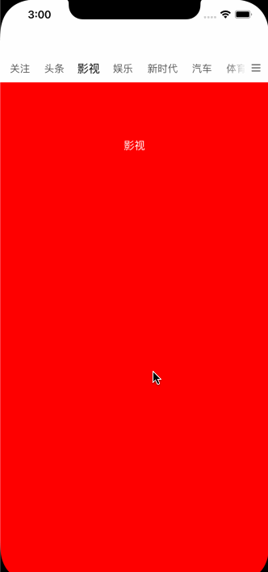

# YYPageView

新闻菜单

#### 使用方式：

1. 把 YYPageView 文件夹 copy 到项目中
2. 初始化 YYPageView

   ```swift
   let frame = CGRect(x: 0, y: LayoutConstants.navBarHeight, width: view.frame.size.width, height: view.frame.size.height - LayoutConstants.navBarHeight)

   let pageView = YYPageView(frame, viewControllers: self.viewControllers, titles: self.titles, parentViewController: self, layout: self.layout, index: 0)
   pageView.delegate = self
   self.pageView = pageView
   self.view.addSubview(pageView)
   ```
3. 实现 delegate

   ```swift
   // MARK: YYPageViewDelegate
   extension ViewController: YYPageViewDelegate {

       func didMoveToPage(_ page: Int) {

       }

   }
   ```

#### 效果图如下：


